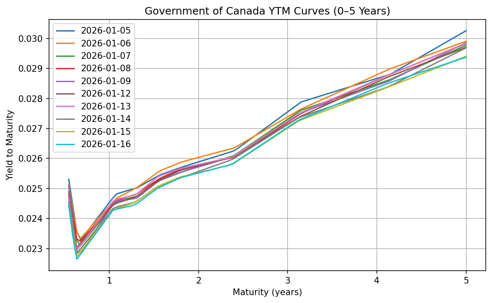
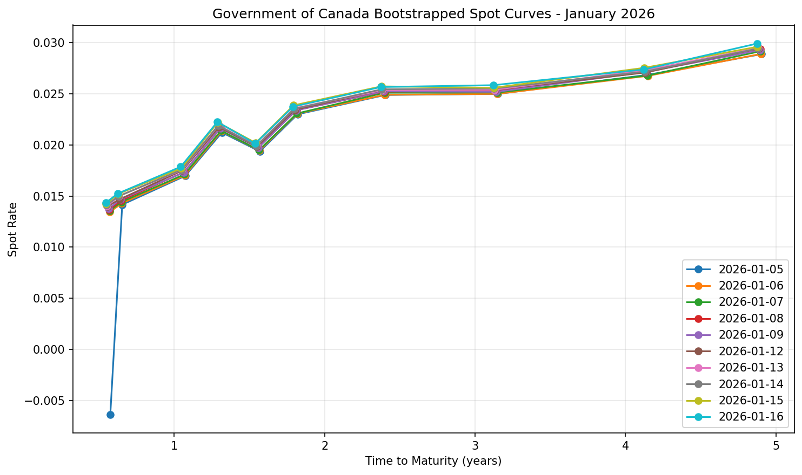
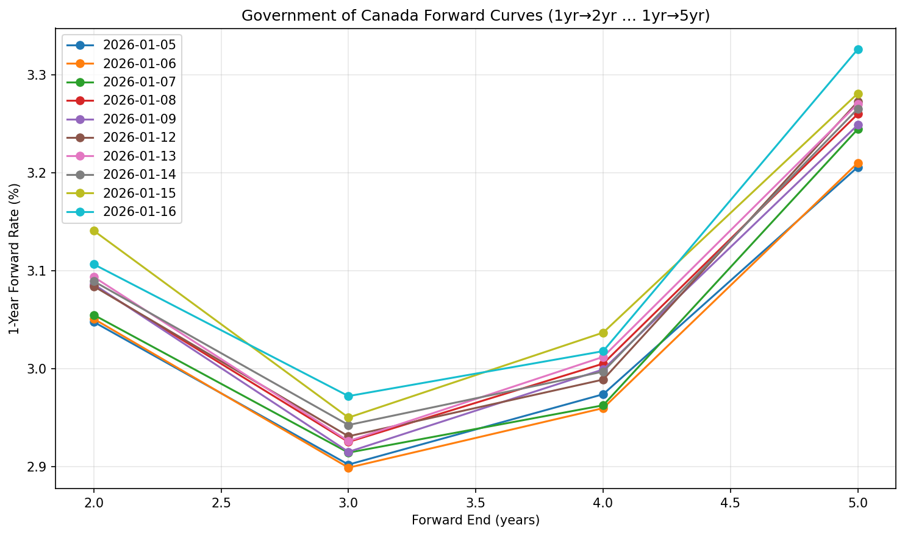
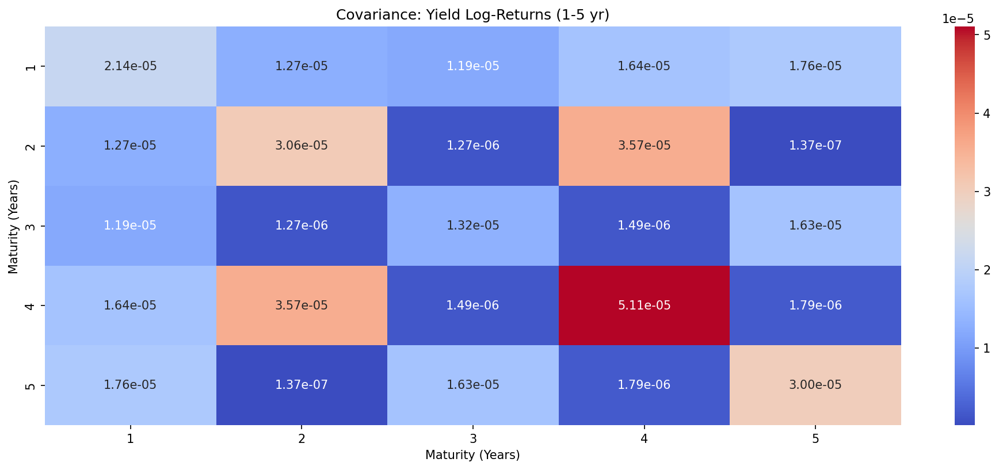
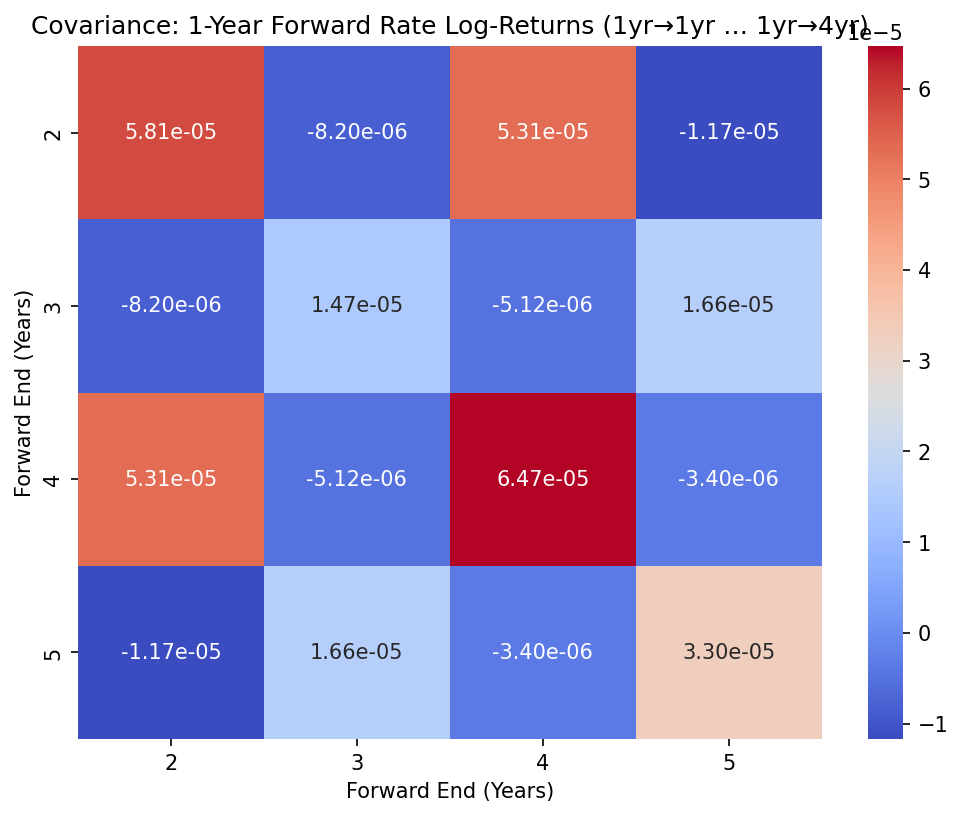

# MAT1856/APM466: Mathematical Finance Winter 2026
## Assignment #1: The Value of Time

**Student Name:** David Goh
**Student ID:** 1012375243
**Date:** Feb 2, 2026

---

## 2.1 Fundamental Questions

### Question 1 (5 points)

**(a)** Why do governments issue bonds and not simply print more money?

Governments issue bonds to finance spending without causing inflation. Printing money increases the money supply and can devalue the currency, whereas bonds borrow from investors and pay them back with interest, keeping the economy stable.

**(b)** Give a hypothetical example of why the long-term part of a yield curve might flatten.

If investors expect short-term interest rates to fall in the future or anticipate slower economic growth, demand for long-term bonds rises, lowering their yields. As short-term rates remain steady or decline slightly, the long-term yields fall closer to short-term yields, flattening the curve.

**(c)** Explain what quantitative easing is and how the (US) Fed has employed this since the beginning of the COVID-19 pandemic.

Quantitative easing (QE) is when a central bank buys large amounts of government or mortgage-backed securities to inject liquidity into the economy and lower long-term interest rates. Since COVID-19, the US Fed used QE by purchasing Treasury and mortgage-backed bonds to stabilize financial markets and support lending and economic activity.

### Question 2 (10 points)

Select 10 bonds that you will use to construct the 0-5 year yield and spot curves with an explanation of why you selected those 10 bonds.

**Selected Bonds:**

1. CAN 4 Aug 26
2. CAN 1 Sep 26
3. CAN 3 Feb 27
4. CAN 2.75 May 27
5. CAN 2.5 Aug 27
6. CAN 2.5 Nov 27
7. CAN 2 Jun 28
8. CAN 4 Mar 29
9. CAN 2.75 Mar 30
10. CAN 0.5 Dec 30

**Explanation:**

We consider a fixed universe of Canadian government bonds obtained from the Markets Insider bond finder (short- and mid-term), frozen for reproducibility. Markets Insider’s bond pages correspond to the Frankfurt listing of these instruments.

Bonds were selected to span approximately 0.5 to 5 years to maturity relative to 5 January 2026. Maturities are reasonably evenly spaced along the short and medium segments of the yield curve, with no two bonds sharing nearly identical maturities. All selected securities are Government of Canada fixed-coupon bonds with semiannual payments, ensuring homogeneity and suitability for yield curve construction.

### Question 3 (10 points)

In a few plain English sentences, in general, if we have several stochastic processes for which each process represents a unique point along a stochastic curve (assume points/processes are evenly distributed along the curve), what do the eigenvalues and eigenvectors associated with the covariance matrix of those stochastic processes tell us?

When multiple stochastic processes represent points along a curve, the eigenvalues of their covariance matrix indicate how much each independent mode contributes to the curve’s total variability. The corresponding eigenvectors describe the shape of these modes — for example, a parallel shift of the entire curve, a tilt between short and long ends, or a curvature change in the middle. The largest eigenvalue and its eigenvector highlight the dominant way the curve moves over time and which segments drive most of its variation.

---

## 2.2 Empirical Questions

### Question 4(a) (10 points)

Calculate each of your 10 selected bonds' yield (ytm) and provide a well-labeled plot with a 5-year yield curve corresponding to each day of data superimposed on top of each other.

**Interpolation Technique Used:**

The yield curves are linearly interpolated over 0.6–5 years, starting at 0.545 years because the shortest-maturity bond in the selected set has a time-to-maturity of approximately 0.55 years. Interpolation below this point would require extrapolation, which could produce unrealistic values. All yields are computed from dirty prices, which include accrued interest, ensuring that the YTMs accurately reflect the market value of each bond at the observation date.

**Plot:**

### Question 4(b) (15 points)

**Pseudo-code for deriving the spot curve:**

Input: A list of bonds for each date with fields: Dirty Price, Coupon, T (time to maturity in years)

1. For each day in your data:
    a. Select all bonds for that day.
    b. Sort bonds by increasing maturity T.

2. Initialize empty list: spot_rates = []

3. For each bond in the sorted list:
    a. Determine the number of periods (semiannual):
        n_periods = ceil(T * 2)   # half-year periods
        period_coupon = Coupon / 2

    b. Construct cash flows:
        cash_flows = [period_coupon] * (n_periods - 1) + [100 + period_coupon]
        time_periods = [0.5, 1.0, 1.5, ..., T]   # half-year increments

    c. If this is the first bond (shortest maturity):
        spot_rate = (last cash flow / Price)^(1 / T) - 1
    d. Else:
        - Discount all previous cash flows using already calculated spot rates.
        - residual = Price - PV(previous cash flows)
        - Solve for new spot_rate:
            spot_rate = (last cash flow / residual)^(1 / last_period) - 1

    e. Append spot_rate to spot_rates

4. Interpolate spot_rates to desired term points (e.g., 1 to 5 years) if necessary.
5. Store spot curve for that day.

6. Repeat for all days in dataset.

**Plot:**

### Question 4(c) (15 points)

**Pseudo-code for deriving the 1-year forward curve:**

For each observation date in the dataset:
    1. Select all bonds for that date.
    2. Sort bonds by time-to-maturity (T).
    3. Obtain spot rates for each bond (S_T) from the bootstrapped spot curve.
    4. Convert spot rates to continuous compounding if needed:
        S_cont = 2 * ln(1 + S_semi / 2)
    5. Interpolate the spot curve to get exact 1, 2, 3, 4, 5-year spot rates.
    6. Compute 1-year forward rates starting at year 1:
        For n in 1 to 4:
            F_1,n = (S_{1+n} * (1+n) - S_1 * 1) / n
    7. Store the forward rates along with the observation date.

After processing all dates:
    8. Plot the forward curves:
        - X-axis: forward period end (2, 3, 4, 5)
        - Y-axis: 1-year forward rate (%)
        - Overlay curves for all observation dates.
        - Add title, axis labels, and legend.

**Plot:**

### Question 5 (20 points)

**Covariance Matrix for Yield (Spot, not YTM) Rates:**

**Covariance Matrix for Forward Rates:**

### Question 6 (15 points)

**Eigenvalues and Eigenvectors for Yield (Spot, not YTM) Rates:**

Eigenvalues:
PC1: 8.67e-05 (59.24% explained)
PC2: 4.89e-05 (33.42% explained)
PC3: 4.83e-06 (3.30% explained)
PC4: 3.17e-06 (2.17% explained)
PC5: 2.74e-06 (1.87% explained)

Eigenvectors:
PC1: [-0.35763802 -0.5475572  -0.12009497 -0.72728972 -0.17000887]
PC2: [-0.39381968  0.2197008  -0.44454647  0.27111253 -0.72492348]
PC3: [ 0.55405843  0.36951909  0.25312472 -0.47082506 -0.52031388]
PC4: [ 0.57348725 -0.67244544 -0.2159802   0.32133718 -0.26272509]
PC5: [ 0.28483809  0.25136715 -0.82294354 -0.26946954  0.32531818]

**Eigenvalues and Eigenvectors for Forward Rates:**

Eigenvalues (Forward Rates):
PC1: 1.17e-04 (68.75% explained)
PC2: 4.16e-05 (24.37% explained)
PC3: 7.28e-06 (4.27% explained)
PC4: 4.46e-06 (2.61% explained)

Eigenvectors:
PC1: [ 0.68101776 -0.11338874  0.70860536 -0.14572665]
PC2: [-0.01522772  0.47374138  0.26324361  0.84026188]
PC3: [-0.68924434 -0.40044277  0.60332329  0.02426586]
PC4: [ 0.24683024 -0.77611706 -0.25413038  0.52166549]

**Interpretation:**

The first eigenvalue for both spot and forward rates captures the largest portion of variability in the curve (around 59% for spots and 69% for forwards). Its corresponding eigenvector indicates the dominant mode of movement: for the spot curve, it represents a nearly parallel shift across maturities, while for the forward curve, it highlights how short- and mid-term forward rates move together as the primary driver of changes over time.
---

## References

1. The scraper supplied by Jaspreet Khela https://colab.research.google.com/drive/1kCYtYmExgO7-iXjSc_2Pj87BsRBJGZnp?usp=sharing

**GitHub Repository:** https://github.com/davidcagoh/bond-yield-calculator